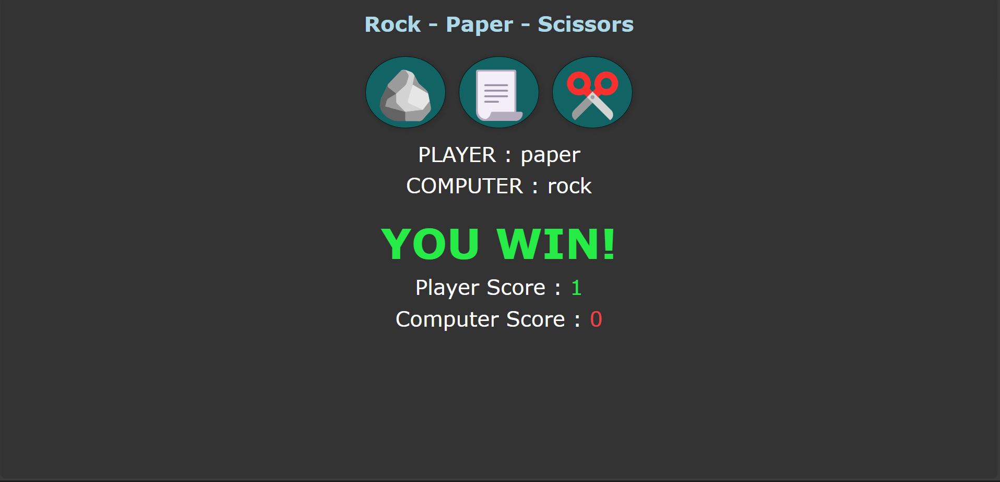

# 🪨📄✂️ Stone, Paper, Scissors Game

A simple and interactive Stone, Paper, Scissors game built using **HTML**, **CSS**, and **JavaScript**. Challenge the computer and see if you can win!

## 🎮 Features

- Intuitive UI with start screen and animations
- Real-time game logic to determine win/loss/tie
- Responsive design for desktop and mobile
- Smooth button animations and transitions

## 📸 Demo
<!--


-->
<p align="center">
  
  
</p>

## 🚀 Live Preview

You can play it live here: [https://ferozhasnain1504.github.io/stone-paper-scissors-Game/](#)  
<!-- Replace # with your GitHub Pages or Netlify/Vercel deployed link -->

## 🛠️ Tech Stack

- **HTML** – Structure
- **CSS** – Styling and animations
- **JavaScript** – Game logic and interactivity

## 🔧 How to Run Locally

1. Clone the repository:
   ```bash
   git clone https://github.com/Ferozhasnain1504/stone-paper-scissors-Game.git
2. Navigate into the project directory:
   ```bash
   cd stone-paper-scissors-Game
3. Open index.html in your browser.

## 📁 Folder Structure

stone-paper-scissors-Game/
├── screenshots
    ├──home page.png
    └──game.png
├── index.html
├── style.css
├── script.js
└── README.md

## 📌 Game Rules
- Stone beats Scissors

- Scissors beats Paper

- Paper beats Stone

- First to score X points wins (or play infinitely)


## 📄 License
This project is licensed under the MIT License.

## 🙌 Acknowledgements
This project is inspired by the original UI of Facebook and is for educational/demo purposes only.

## 💡 Contributions Welcome!
Feel free to fork this repo, add improvements, and submit a pull request!

Made with ❤️ by Feroz Hasnain
---

Let me know if you'd like:
- A **GitHub Pages deployment guide**
- A **Dark Mode toggle feature**
- Or help creating a **more realistic newsfeed UI**
